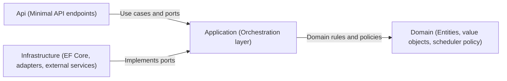

# Layered Architecture

```mermaid
flowchart LR
    api["Api (Minimal API endpoints)"] -->|"Use cases and ports"| app["Application (Orchestration layer)"]
    infra["Infrastructure (EF Core, adapters, external services)"] -->|"Implements ports"| app
    app -->|"Domain rules and policies"| domain["Domain (Entities, value objects, scheduler policy)"]
```
