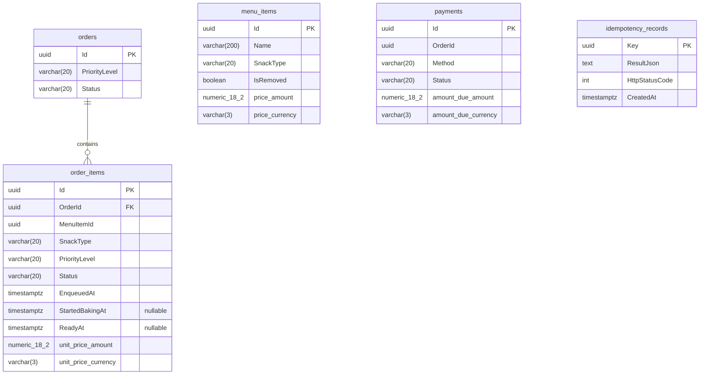

# Entity-Relationship Diagram

Schema produced by `InitialCreate`. Enums are stored as `varchar(20)` strings.
Money values are inlined as two columns (`_amount numeric(18,2)` + `_currency varchar(3)`).

