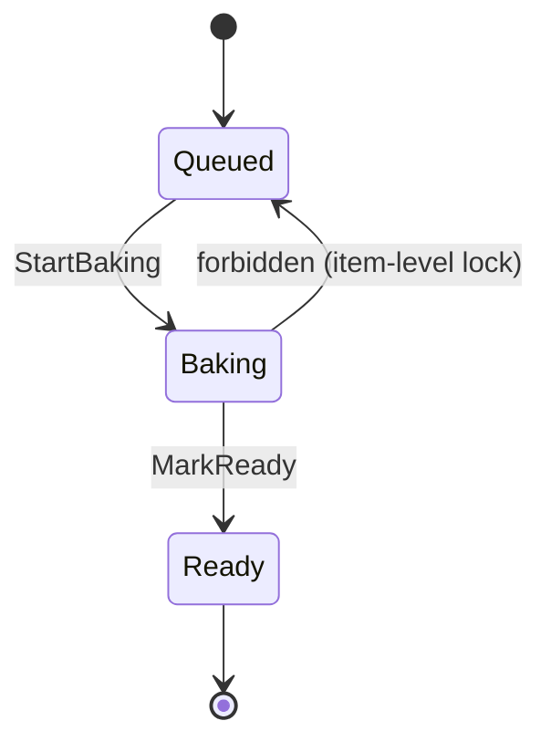
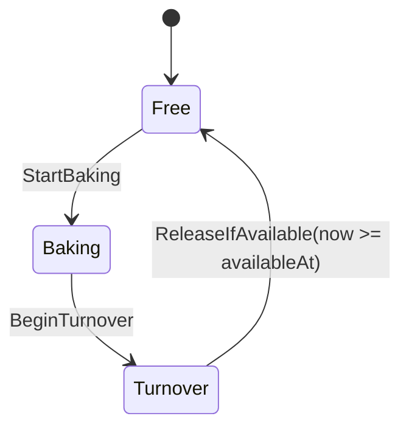

# Domain state diagrams

The diagrams show item-level lifecycle guards and slot turnover delay as implemented in the domain model.

## OrderItem lifecycle

```mermaid
stateDiagram-v2
    [*] --> Queued
    Queued --> Baking : StartBaking
    Baking --> Ready : MarkReady
    Baking --> Queued : forbidden (item-level lock)
    Ready --> [*]
```

## OvenSlot lifecycle

```mermaid
stateDiagram-v2
    [*] --> Free
    Free --> Baking : StartBaking
    Baking --> Turnover : BeginTurnover
    Turnover --> Free : ReleaseIfAvailable(now >= availableAt)
```
