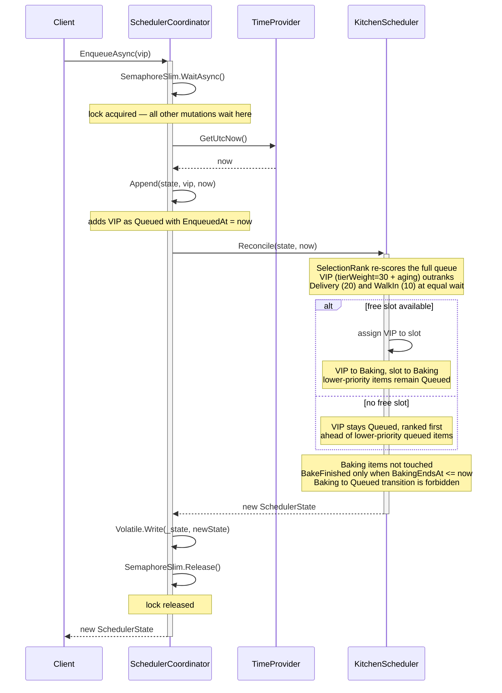
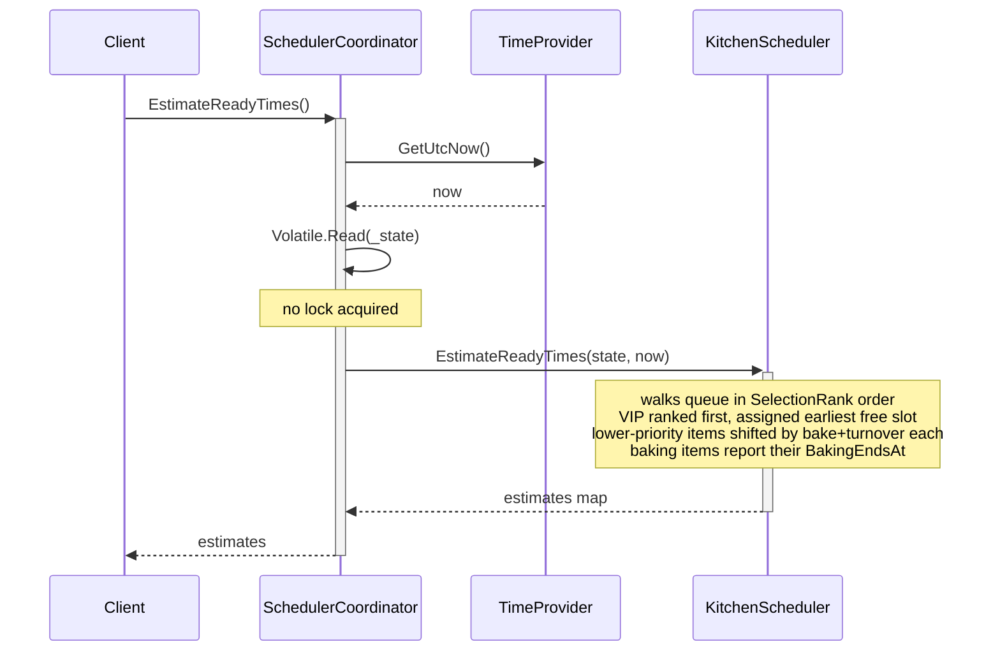

# VIP scheduling sequence

A VIP item arrives via `SchedulerCoordinator.EnqueueAsync`. The coordinator serializes the
mutation under a single `SemaphoreSlim(1,1)`, delegates the pure scheduling decision to
`KitchenScheduler.Reconcile`, and publishes the new state lock-free via `Volatile.Write`.
The subsequent estimate read requires no lock.

## Mutation path (under the single lock)

## Read path (lock-free)

After the mutation completes, callers read estimates without acquiring the lock.

## Lock boundary summary

| Operation | Lock | State change |
|-----------|------|--------------|
| `EnqueueAsync` | acquired | appends item, runs Reconcile, publishes new state |
| `ReconcileAsync` | acquired | runs Reconcile on current state, publishes new state |
| `GetSnapshot` | none | returns `Volatile.Read(_state)` |
| `EstimateReadyTimes` | none | reads snapshot, calls pure Domain projection |
